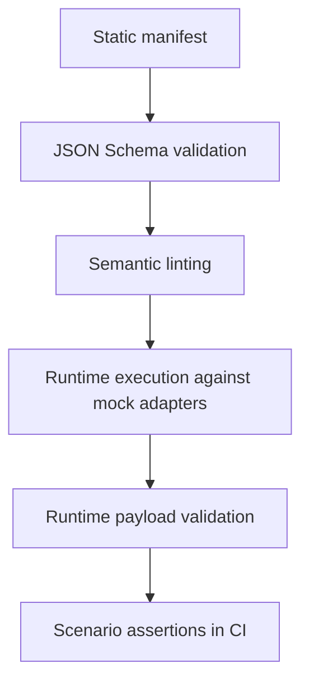
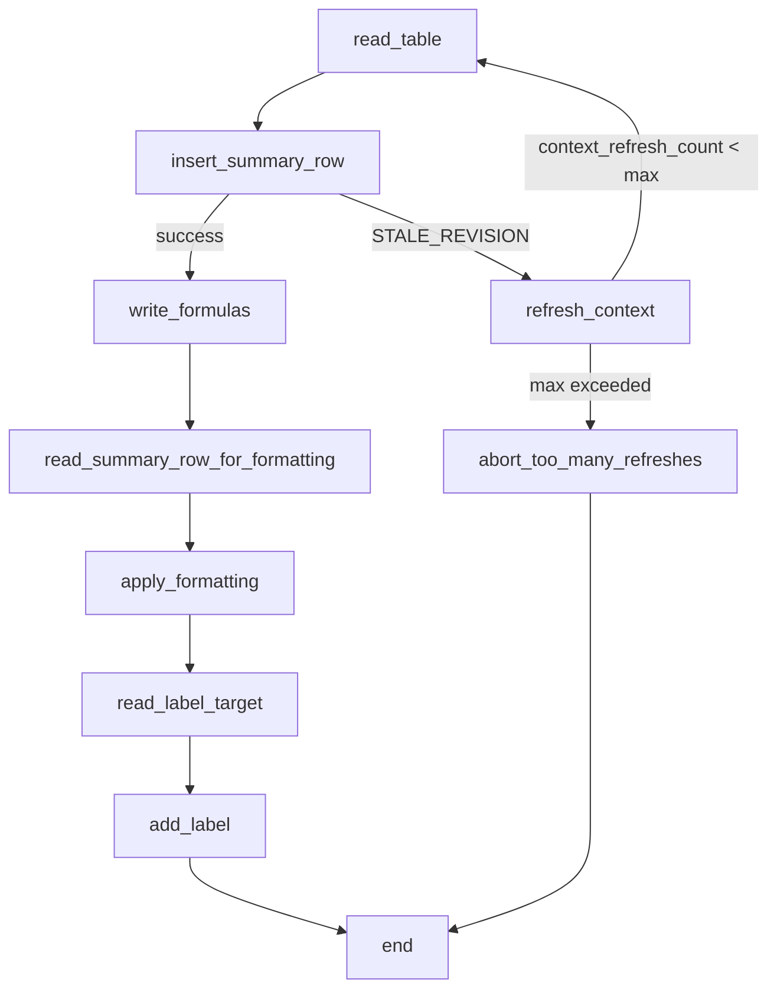

# ANAC Spec

ANAC is a working draft for an agent-facing application contract: a static manifest plus runtime payloads that let an orchestrator execute workflows with state, concurrency, and failure semantics instead of blind tool calling.

This repository contains three things:

- the normative draft: [`ANAC-0.1.2.md`](ANAC-0.1.2.md)
- the `0.2` restructuring plan: [`docs/anac-0.2-plan.md`](docs/anac-0.2-plan.md)
- the runtime-only external-test draft: [`docs/specs/runtime.md`](docs/specs/runtime.md)
- the runtime feedback note: [`docs/runtime-feedback-note.md`](docs/runtime-feedback-note.md)
- the builder-facing overview: [`docs/positioning.md`](docs/positioning.md)
- the launch-facing draft: [`docs/show-hn.md`](docs/show-hn.md)
- the launch variants: [`docs/launch/`](docs/launch)
- the first live-adapter path: [`docs/google-sheets-live.md`](docs/google-sheets-live.md)
- the place to store credentialed live traces: [`docs/traces/`](docs/traces)
- machine-validatable schemas for the static and runtime payloads in [`schema/`](schema)
- executable examples plus validation tooling in [`examples/`](examples) and [`scripts/`](scripts)

## What This Repo Proves

The repo is no longer just a spec draft. It has an executable validation stack.



Today that stack covers:

- 2 adapters: `SheetApp`, `VectorForge`
- 5 runtime scenarios:
  - `SheetApp` happy path
  - `SheetApp` stale revision recovered
  - `SheetApp` stale revision exhausted
  - `VectorForge` happy path
  - `VectorForge` non-retryable `PERMISSION_DENIED`
- 4 enforced layers:
  - static manifest schema validation
  - semantic linting beyond JSON Schema
  - runtime payload validation for `context_frame`, `action_result`, and `outcome`
  - scenario-level integration assertions

## Quick Start

Install the single Python dependency used by the validators:

```bash
python3 -m pip install jsonschema
```

Run the full local validation stack:

```bash
python3 examples/validate_examples.py
python3 scripts/anac_lint.py --strict examples/*.json
python3 scripts/validate_runtime_demo.py
```

Optional live-adapter dependencies:

```bash
python3 -m pip install -r requirements-google-live.txt
```

Run the CI-equivalent entry points individually:

```bash
python3 scripts/anac_runtime_demo.py
python3 scripts/anac_runtime_demo.py --manifest examples/example-vectorforge-0.1.2.json --workflow refresh_accessible_asset
```

## Repository Map

- [`ANAC-0.1.2.md`](ANAC-0.1.2.md): current normative draft
- [`docs/positioning.md`](docs/positioning.md): builder-facing positioning document
- [`docs/google-sheets-live.md`](docs/google-sheets-live.md): setup and usage for the first live adapter
- [`docs/traces/README.md`](docs/traces/README.md): naming and capture guidance for live trace artifacts
- [`schema/anac-core-0.1.2.schema.json`](schema/anac-core-0.1.2.schema.json): static manifest schema
- [`schema/anac-context-frame-0.1.2.schema.json`](schema/anac-context-frame-0.1.2.schema.json): runtime `context_frame` schema
- [`schema/anac-action-result-0.1.2.schema.json`](schema/anac-action-result-0.1.2.schema.json): runtime `action_result` schema
- [`schema/anac-outcome-0.1.2.schema.json`](schema/anac-outcome-0.1.2.schema.json): runtime workflow `outcome` schema
- [`examples/example-sheetapp-0.1.2.json`](examples/example-sheetapp-0.1.2.json): procedural spreadsheet example
- [`examples/example-vectorforge-0.1.2.json`](examples/example-vectorforge-0.1.2.json): spatial/creative-tool example
- [`examples/validate_examples.py`](examples/validate_examples.py): static schema validation
- [`scripts/anac_lint.py`](scripts/anac_lint.py): semantic linting
- [`scripts/anac_runtime_demo.py`](scripts/anac_runtime_demo.py): toy runtime executor with mock adapters
- [`scripts/anac_google_sheets_live.py`](scripts/anac_google_sheets_live.py): experimental live Google Sheets adapter for `SheetApp`
- [`scripts/capture_google_sheets_trace.py`](scripts/capture_google_sheets_trace.py): writes a commit-ready live trace artifact to `docs/traces/`
- [`scripts/validate_runtime_demo.py`](scripts/validate_runtime_demo.py): runtime validation and scenario checks
- [`requirements-google-live.txt`](requirements-google-live.txt): optional dependencies for the live adapter
- [`.github/workflows/validate-anac.yml`](.github/workflows/validate-anac.yml): CI workflow

## Runtime Contract

The runtime demo emits three validated payload classes:

- `context_frame`: what the orchestrator currently sees
- `action_result`: what an action invocation returned
- `outcome`: how the workflow terminated

`outcome` is now formalized because it held across two adapters and three failure modes without needing new top-level fields.

Current `outcome` fields:

- `status`: `success` or `failure`
- `disposition`: terminal mode such as `completed`, `completed_after_retry`, `failed_retry_exhausted`, or `failed_non_retryable`
- `reason`: why the workflow stopped
- `terminal_step`
- `terminal_transition`
- `last_error_code`
- `context_refresh_count`
- `stale_retry_count`

The runtime result also includes an adapter-defined `artifacts` object. That is intentionally not standardized.

- `SheetApp`: `summary_row`
- `VectorForge`: `published_refs`, `group_position`, `applied_tokens`, `export_job`

## Executable Concurrency Example

The `SheetApp` workflow is the concrete concurrency proof in this repo. It uses optimistic concurrency, retries once state has been refreshed, and aborts cleanly when retries are exhausted.



That loop is not hypothetical. It is exercised by:

```bash
python3 scripts/anac_runtime_demo.py --force-stale-step insert_summary_row --force-stale-count 1
python3 scripts/anac_runtime_demo.py --force-stale-step insert_summary_row --force-stale-count 2
```

## Adapter Matrix

### SheetApp

Commands:

```bash
python3 scripts/anac_runtime_demo.py
python3 scripts/anac_runtime_demo.py --force-stale-step insert_summary_row --force-stale-count 1
python3 scripts/anac_runtime_demo.py --force-stale-step insert_summary_row --force-stale-count 2
```

Observed dispositions:

- `completed`
- `completed_after_retry`
- `failed_retry_exhausted`

### VectorForge

Commands:

```bash
python3 scripts/anac_runtime_demo.py --manifest examples/example-vectorforge-0.1.2.json --workflow refresh_accessible_asset
python3 scripts/anac_runtime_demo.py --manifest examples/example-vectorforge-0.1.2.json --workflow refresh_accessible_asset --deny-permission asset.publish
```

Observed dispositions:

- `completed`
- `failed_non_retryable`

This adapter matters because it proves the runtime contract is not spreadsheet-specific:

- it uses `confirm`
- it uses `wait`
- it fails for a non-concurrency reason
- it keeps `context_refresh_count` and `stale_retry_count` at zero when those mechanisms are not involved

## Validation Layers

### 1. Static Schema Validation

```bash
python3 examples/validate_examples.py
```

Validates manifest structure against [`schema/anac-core-0.1.2.schema.json`](schema/anac-core-0.1.2.schema.json).

### 2. Semantic Linting

```bash
python3 scripts/anac_lint.py --strict examples/*.json
```

Checks what JSON Schema cannot express, including:

- cross-reference integrity
- workflow transition validity
- tier-level requirements
- revision handling
- `watch_binding` and `workflow_ref` resolution
- basic CEL scope sanity

### 3. Runtime Payload Validation

```bash
python3 scripts/validate_runtime_demo.py
```

Validates emitted runtime payloads against:

- [`schema/anac-context-frame-0.1.2.schema.json`](schema/anac-context-frame-0.1.2.schema.json)
- [`schema/anac-action-result-0.1.2.schema.json`](schema/anac-action-result-0.1.2.schema.json)
- [`schema/anac-outcome-0.1.2.schema.json`](schema/anac-outcome-0.1.2.schema.json)

### 4. CI

GitHub Actions runs the same checks on pushes to `main`, pull requests, and manual dispatch.

See [`.github/workflows/validate-anac.yml`](.github/workflows/validate-anac.yml).

## Current Boundaries

What this repo does well now:

- validates the static contract
- validates semantic consistency beyond the static schema
- executes real workflow traces against multiple adapters
- validates runtime payloads and scenario outcomes

What it does not do yet:

- full CEL parsing or static type-checking
- a formal schema for the entire top-level runtime envelope
- adapter-independent semantics for `artifacts`
- citation verification for the research references in earlier drafts

## Next Useful Work

- add a third adapter or scenario that fails asynchronously inside `wait`
- formalize the top-level runtime envelope if a second executor implementation converges on the same shape
- split a shorter positioning document out from the normative draft
