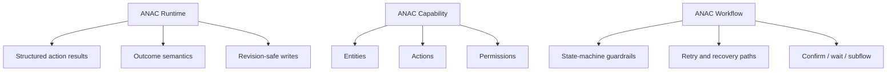

# ANAC 0.2 Restructuring Plan

This document translates the current critique of ANAC into a concrete restructuring plan for the repository and the specification itself.

The goal is not to discard `0.1.2`. The goal is to separate the parts that are already strong and adoptable from the parts that are still too expensive or too prescriptive to expect external adoption.

## Executive Summary

ANAC `0.1.2` currently bundles three different things:

1. runtime conventions for revision-safe execution
2. static capability description for entities and actions
3. hand-authored workflow semantics

Those should become three layers in `0.2`:

- `ANAC Runtime`
- `ANAC Capability`
- `ANAC Workflow`

The immediate consequence is that ANAC stops presenting itself as one mandatory stack.

Instead:

- `Runtime` becomes the small, adoptable core
- `Capability` becomes the medium-cost description layer
- `Workflow` becomes the optional, advanced layer for guardrails and recovery logic

This addresses the strongest external objections:

- authoring cost
- over-early normativity
- coupling of static and operational concerns
- adoption economics for vendors

## What Changes Substantively

### 1. ANAC Runtime becomes the core product

This is the most mature and defensible part of the project today.

It includes:

- `expected_revision`
- `STALE_REVISION`
- retryable vs non-retryable failures
- `action_result`
- `outcome`
- structured workflow termination

This is the piece most likely to be adopted independently of the full manifest story.

### 2. Capability and workflow are separated

The current manifest combines:

- durable application structure
- operational logic and guardrails

These need to be different artifacts.

`Capability` is the static contract:

- entities
- actions
- parameter schemas
- read/write surfaces
- permissions

`Workflow` is the behavioral contract:

- state-machine steps
- transitions
- retry paths
- confirmation points
- wait steps
- optional recovery logic

This lowers the bar for a vendor that wants typed actions and revision tracking without committing to full workflow authoring.

### 3. Predicate language becomes a profile, not a hard gate

`0.1.2` hardwires CEL too early.

For `0.2`, predicates should be treated as a pluggable profile:

- `none`
- `cel`
- future: `jsonlogic` or another minimal profile

The base runtime and capability layers should not depend on full predicate support to be useful.

### 4. Workflow is repositioned as optional guardrail logic

The strongest use case proven today is not “generic workflow modeling.”

It is:

- concurrency recovery
- destructive-action guardrails
- explicit confirmation boundaries
- failure routing

`Workflow` should therefore be framed in `0.2` as an optional advanced layer for applications that need those controls.

That is a narrower and more defensible claim than “general software workflow standard.”

## Target Architecture for 0.2



## Proposed Spec Split

### ANAC Runtime

Purpose:

- standardize execution-time behavior
- minimize authoring burden
- give any orchestrator a reliable error/retry contract

Normative surface:

- `action_result`
- `outcome`
- `expected_revision`
- `stale_entities`
- retryable failure semantics
- workflow-level terminal dispositions

This is the piece that should be able to stand on its own.

### ANAC Capability

Purpose:

- describe what the application exposes
- be at least partly auto-generatable

Normative surface:

- `EntityDefinition`
- `ActionDefinition`
- parameter schemas
- `reads_types` / `writes_types`
- permissions
- optional bindings/predicates

This layer should have a clear import path from:

- OpenAPI
- MCP tool definitions
- existing typed internal APIs

### ANAC Workflow

Purpose:

- encode application-authored behavioral logic
- handle recovery, confirmation, and sequencing where vendors actually need it

Normative surface:

- workflow definition
- typed state-machine steps
- transitions
- lease / retry bounds
- optional predicate profiles

This layer should be explicitly optional.

## Repo Mapping: Current -> Target

### Current files that already map cleanly to `ANAC Runtime`

- [schema/anac-action-result-0.1.2.schema.json](/Users/ericorr/Documents/Legal%20LLM%20AWS/FunStuff/schema/anac-action-result-0.1.2.schema.json)
- [schema/anac-context-frame-0.1.2.schema.json](/Users/ericorr/Documents/Legal%20LLM%20AWS/FunStuff/schema/anac-context-frame-0.1.2.schema.json)
- [schema/anac-outcome-0.1.2.schema.json](/Users/ericorr/Documents/Legal%20LLM%20AWS/FunStuff/schema/anac-outcome-0.1.2.schema.json)
- [scripts/anac_runtime_demo.py](/Users/ericorr/Documents/Legal%20LLM%20AWS/FunStuff/scripts/anac_runtime_demo.py)
- [scripts/validate_runtime_demo.py](/Users/ericorr/Documents/Legal%20LLM%20AWS/FunStuff/scripts/validate_runtime_demo.py)
- [scripts/anac_google_sheets_live.py](/Users/ericorr/Documents/Legal%20LLM%20AWS/FunStuff/scripts/anac_google_sheets_live.py)

These should become the nucleus of `ANAC Runtime`.

### Current files that map to `ANAC Capability`

- [schema/anac-core-0.1.2.schema.json](/Users/ericorr/Documents/Legal%20LLM%20AWS/FunStuff/schema/anac-core-0.1.2.schema.json), but only the entity/action subset
- [examples/example-sheetapp-0.1.2.json](/Users/ericorr/Documents/Legal%20LLM%20AWS/FunStuff/examples/example-sheetapp-0.1.2.json), split into capability and workflow pieces
- [examples/example-vectorforge-0.1.2.json](/Users/ericorr/Documents/Legal%20LLM%20AWS/FunStuff/examples/example-vectorforge-0.1.2.json), same split

The current core schema is too broad to remain the entry point unchanged.

### Current files that map to `ANAC Workflow`

- workflow sections inside both example manifests
- workflow step logic currently validated by [scripts/anac_lint.py](/Users/ericorr/Documents/Legal%20LLM%20AWS/FunStuff/scripts/anac_lint.py)
- workflow execution semantics in [scripts/anac_runtime_demo.py](/Users/ericorr/Documents/Legal%20LLM%20AWS/FunStuff/scripts/anac_runtime_demo.py)

This should become an explicit advanced layer rather than part of the minimum manifest story.

## Proposed File Layout

This is the target repo structure for `0.2`.

```text
docs/
  anac-0.2-plan.md
  specs/
    runtime.md
    capability.md
    workflow.md
    migration-0.1-to-0.2.md

schema/
  runtime/
    anac-action-result-0.2.schema.json
    anac-context-frame-0.2.schema.json
    anac-outcome-0.2.schema.json
  capability/
    anac-capability-0.2.schema.json
  workflow/
    anac-workflow-0.2.schema.json

examples/
  runtime/
  capability/
  workflow/
  bundles/
    sheetapp/
    vectorforge/

scripts/
  anac_runtime_demo.py
  anac_lint_runtime.py
  anac_lint_capability.py
  anac_lint_workflow.py
  anac_generate_capability.py
```

This does not all need to happen at once, but it is the intended direction.

## Phased Migration Plan

### Phase 1: Freeze `0.1.2`, publish `0.2` architecture

Deliverables:

- keep [ANAC-0.1.2.md](/Users/ericorr/Documents/Legal%20LLM%20AWS/FunStuff/ANAC-0.1.2.md) as the frozen integrated draft
- publish this restructuring document
- update the README so the repo clearly distinguishes:
  - current integrated draft
  - proposed `0.2` layered direction

Success criterion:

- the repo stops implying that the current integrated spec is the only intended shape

### Phase 2: Carve out `ANAC Runtime`

Deliverables:

- `docs/specs/runtime.md`
- `schema/runtime/*`
- runtime-only validation commands in CI

Scope:

- no workflow authoring required
- no capability manifest authoring required beyond what runtime execution needs

Success criterion:

- someone can adopt `action_result`, `outcome`, and revision-safe error semantics without adopting the rest of ANAC

### Phase 3: Split capability from workflow in the examples

Deliverables:

- `examples/bundles/sheetapp/`
- `examples/bundles/vectorforge/`
- each bundle contains:
  - `capability.json`
  - `workflow.json`
  - optional `bundle.json`

Success criterion:

- the examples demonstrate that a vendor can publish capability without publishing the full workflow layer

### Phase 4: Capability generation path

Deliverables:

- initial generator at `scripts/anac_generate_capability.py`
- first target: import from a minimal OpenAPI fragment or MCP-style tool description

Success criterion:

- ANAC has an answer to the authoring-cost objection

This phase matters more than additional spec prose.

### Phase 5: Predicate profiles

Deliverables:

- `predicate_profile` field in capability/workflow docs
- `none` profile supported first
- `cel` profile retained as an advanced option rather than hard baseline

Success criterion:

- the spec no longer requires an implementation to buy into CEL before it can do useful work

### Phase 6: External trial

Deliverables:

- one external capability manifest or runtime implementation by someone other than the repo author

Success criterion:

- ANAC gets its first real evidence of external generality instead of self-consistency only

## Immediate Repo Tasks

These are the next concrete tasks that follow from the `0.2` direction.

1. Add `docs/specs/runtime.md` as the first carved-out spec.
2. Add `docs/specs/capability.md` describing the static contract without workflows.
3. Split `SheetApp` and `VectorForge` into capability/workflow bundles.
4. Refactor [scripts/anac_lint.py](/Users/ericorr/Documents/Legal%20LLM%20AWS/FunStuff/scripts/anac_lint.py) into smaller lint stages or profiles.
5. Add a capability generator stub from a hand-written OpenAPI subset.
6. Update positioning copy so public-facing claims match the layered direction.

## Public Framing for 0.2

The strongest honest framing is:

- ANAC is not one monolithic spec
- the current repo has already validated a strong runtime contract
- the next step is reducing authoring cost and separating optional workflow logic from the minimum viable contract

That is a better public position than defending the entire `0.1.2` integrated stack as the only shape worth considering.

## What Stays True

The critique does not invalidate the project.

What still holds:

- the problem is real
- the concurrency story is strong
- the runtime contract is valuable
- the executor and live adapter provide real evidence

What changes is the packaging:

- smaller core
- clearer layering
- cheaper adoption path
- fewer claims about generality before external use

That is the practical path from a rigorous solo project to something other people might actually try.
